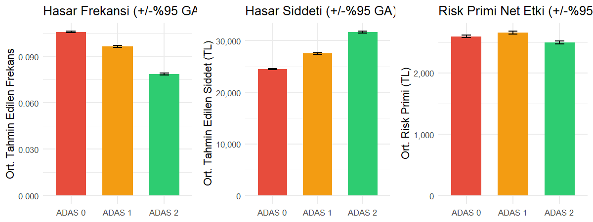
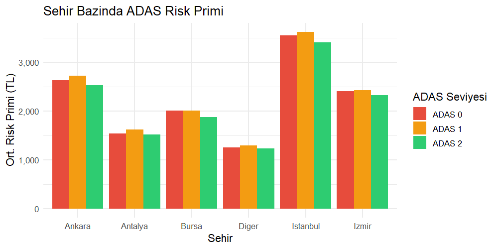

# 🚗 ADAS Pricing Paradox (Vol 1)

<p align="center">
  
  
  
  
</p>

**An End-to-End Actuarial Project** analyzing the trade-off between crash frequency reduction and repair cost inflation in modern vehicles equipped with Advanced Driver Assistance Systems (ADAS).

> 💡 **NOTE:** This is the original Vol 1 analysis. For the advanced model with Gini Index, Lift Charts, and interaction terms, see **[VOL 2 - Advanced Edition](https://github.com/kuurtali/VOL2-ADAS-Pricing-Paradox)**.

---

## 📌 Executive Summary

> *Do ADAS-equipped vehicles actually cost less to insure — or does the rising repair cost of sensor-laden cars cancel out the safety benefit?*

This is the **ADAS Pricing Paradox**: while ADAS reduces accident frequency, the sophisticated sensors and components (LiDAR, radar, cameras embedded in windshields) dramatically increase repair costs per claim.

## 🔍 Key Findings

| ADAS Level | Frequency Change | Severity Change | Net Premium Effect |
|:----------:|:----------------:|:---------------:|:------------------:|
| ADAS 0 (None) | Baseline | Baseline | Baseline |
| ADAS 1 (Basic) | **−9.7%** | **+12.8%** | +1.9% |
| ADAS 2 (Advanced) | **−24.7%** | **+28.6%** | −3.0% |

**The paradox is confirmed:**
- ADAS **reduces crash frequency** by up to 24.7%
- But **increases repair costs** by up to 28.6%
- The net effect on insurance premium is **nearly zero** — the safety benefit is almost entirely offset by higher repair costs



### Segment Insights

- **Istanbul** has the highest risk premiums across all ADAS levels due to traffic density — ADAS 2 still saves ~3% here
- **Antalya and Other (Diğer)** cities show the lowest premiums; paradox effect is proportionally similar
- **Vehicle type** (Hatchback/Sedan/SUV) has negligible impact on the paradox — the frequency–severity trade-off is consistent across segments
- **Driver age** does not significantly differentiate the paradox pattern (p=0.45 in frequency model)



## 🚀 Live Interactive Pricing Engine (R Shiny)

This project features a **fully interactive R Shiny application** with a Cyberpunk UI. You can test the ADAS Pricing Paradox live by changing driver parameters and instantly observing the effects on Frequency, Severity, and the Final Premium via a dynamic Waterfall chart.

- **To run locally:** Open `app.R` in RStudio and click "Run App".

## 🛠️ Pipeline

```
Python (Data)  →  SQL (Features)  →  R (GLM Modeling)  →  R Shiny (App) & Power BI
```

| Step | Tool | Script | Output |
|------|------|--------|--------|
| 1. Data Generation | Python | `src/FirstCodeWithKaggle.py` | `ham_data.csv` |
| 2. Feature Engineering | SQL (via Python) | *(embedded in step 1)* | `SQL_Islem_Gormus_Veri.csv` |
| 3. GLM Analysis | R | `src/analysis.R` | `R_Islem_Gormus_Veri.csv` + outputs |
| 4. Visualization | Power BI | `ADAS_Actuarial_Pricing.pbix` | Interactive dashboard |

## 📊 Methodology

### Train / Test Split & Validation
The dataset was split into **80% Training (80,000 policies)** and **20% Testing (20,000 policies)** to ensure the models do not overfit.
- **Frequency Model RMSE:** 0.313
- **Severity Model RMSE:** 20,529 TL

### Frequency Model (Poisson GLM)
```r
Claim_Count ~ Safety_Package_Level + Driver_Age + Vehicle_Age 
              + City + Vehicle_Segment + NCD_Level + Traffic_Density
              + offset(log(Exposure))
```

### Severity Model (Gamma GLM)
```r
Claim_Amount ~ Safety_Package_Level + Vehicle_Age + Driver_Age
               + Vehicle_Brand + Vehicle_Segment
```

### Risk Premium
```r
Risk_Premium = Predicted_Frequency × Predicted_Severity
```

### Model Interpretation

**Frequency Model** — Statistically significant predictors (p < 0.05):
| Variable | Effect | Interpretation |
|----------|--------|----------------|
| `Safety_Package_Level 1` | −9.4% | Basic ADAS reduces claim frequency |
| `Safety_Package_Level 2` | −24.1% | Advanced ADAS reduces frequency further |
| `Vehicle_Age` | +0.9% per year | Older vehicles → more claims |
| `NCD_Level` | −5.3% per level | Experienced drivers → fewer claims |
| `Traffic_Density` | +15.9% per unit | Denser traffic → more claims |

> `Driver_Age`, `City`, and `Vehicle_Segment` were included but not statistically significant — kept in model for theoretical relevance.

**Severity Model** — Statistically significant predictors (p < 0.05):
| Variable | Effect | Interpretation |
|----------|--------|----------------|
| `Safety_Package_Level 1` | +12.6% | Basic ADAS increases repair cost |
| `Safety_Package_Level 2` | +28.5% | Advanced ADAS → expensive sensor repairs |
| `Vehicle_Brand (BMW)` | Baseline (highest) | Premium brands cost more to repair |
| `Vehicle_Brand (Fiat)` | −59.9% | Economy brands cost least |

> `Vehicle_Age`, `Driver_Age`, and `Vehicle_Segment` were not significant in the severity model.

**Overdispersion**: Pearson χ²/df = 0.98 — no overdispersion detected; Poisson is appropriate (no need for Negative Binomial).

Full model summaries: [`freq_model_summary.txt`](outputs/freq_model_summary.txt) | [`sev_model_summary.txt`](outputs/sev_model_summary.txt)

## 📁 Project Structure

```
ADAS-Pricing-Paradox/
├── src/
│   ├── FirstCodeWithKaggle.py    # Data generation + SQL processing
│   └── analysis.R                # GLM modeling + paradox analysis
├── outputs/
│   ├── figures/                  # Diagnostic & paradox charts (PNG)
│   │   ├── eda_correlation.png   # EDA: Correlation matrix
│   │   ├── eda_distributions.png # EDA: Feature distributions
│   │   ├── paradox_main.png      # Main paradox visualization
│   │   ├── paradox_city.png      # City-level breakdown
│   │   ├── freq_residuals.png    # Frequency model diagnostics
│   │   └── sev_residuals.png     # Severity model diagnostics
│   ├── paradox_summary.csv       # ADAS-level summary statistics
│   ├── segment_city.csv          # City × ADAS breakdown
│   ├── segment_age.csv           # Age group × ADAS breakdown
│   ├── segment_vehicle.csv       # Vehicle type × ADAS breakdown
│   ├── freq_model_summary.txt    # Frequency model coefficients
│   ├── sev_model_summary.txt     # Severity model coefficients
│   └── results.json              # All results (machine-readable)
├── ham_data.csv                  # Raw synthetic dataset (100K policies)
├── .gitignore
├── LICENSE
└── README.md
```

## 🚀 How to Run

### Prerequisites
- Python 3.x
- R 4.x with packages: `dplyr`, `statmod`, `MASS`, `ggplot2`, `jsonlite`, `corrplot`, `gridExtra`
- Power BI Desktop (optional, for interactive dashboard)

### Steps
```bash
# 1. Data is already generated (ham_data.csv)
# 2. SQL processing (if needed to regenerate)
python src/FirstCodeWithKaggle.py

# 3. Run GLM analysis + paradox investigation
Rscript src/analysis.R

# 4. Open Power BI dashboard (optional)
# Open ADAS_Actuarial_Pricing.pbix in Power BI Desktop
```

## 📈 Data

Synthetic insurance portfolio with **100,000 policies** and 12 features:

| Feature | Description |
|---------|-------------|
| `Safety_Package_Level` | ADAS level: 0 (none), 1 (basic), 2 (advanced) |
| `Driver_Age` | Driver age (18–80) |
| `Vehicle_Age` | Vehicle age (0–23 years) |
| `City` | Istanbul, Ankara, Izmir, Bursa, Antalya, Other |
| `Vehicle_Brand` | Fiat, Toyota, Renault, Ford, Honda, BMW |
| `Vehicle_Segment` | Hatchback, Sedan, SUV |
| `Traffic_Density` | Traffic density index (2–10) |
| `NCD_Level` | No-Claim Discount level (0–6) |
| `Exposure` | Policy exposure in years (0–1) |
| `Claim_Count` | Number of claims |
| `Claim_Amount` | Total claim amount (TL) |

## 🔗 Related Projects

| Project | Description |
|---------|-------------|
| [VOL2 — ADAS Pricing Paradox](https://github.com/kuurtali/VOL2-ADAS-Pricing-Paradox) | Extended analysis with 200K policies, GLM interaction terms, Gini Index, Lift Charts |
| [Actuarial Shiny Dashboard](https://github.com/kuurtali/actuarial-analysis-w-shiny-and-glm) | Interactive R Shiny risk scoring with Logistic GLM (AUC 0.828) |
| [Tubitak-2209A-MCAware](https://github.com/kuurtali/Tubitak-2209A-MCAware) | TÜBİTAK 2209-A: anti-predictive behavior in DL stock prediction on BIST |
| [Direction Forecasting BIST-BES](https://github.com/kuurtali/direction-forecasting-bist-bes) | Academic paper: ARIMA vs LSTM vs 1D-CNN on BIST & pension funds |

## 📜 License

This project is licensed under the MIT License — see the [LICENSE](LICENSE) file for details.
